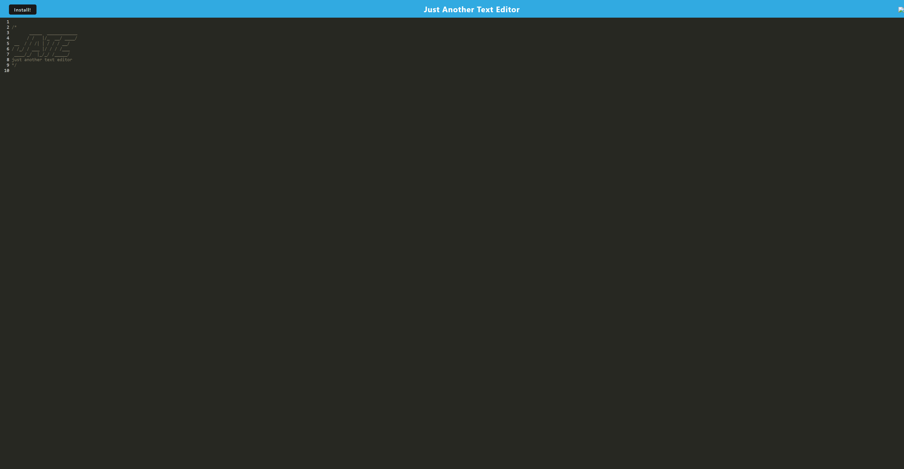

# Text Editor Starter Code
  
## Description
In challenge nineteen we were asked to create a text editor that would allow us to store and edit text. This project helped me understand pwa functionality and how a use rcan install and use an app offline.
## Table of Contents
1. [Install](#install)
2. [Usage](#usage)
3. [Contribution](#contribution)
4. [License](#license)

## install
To install using pwa functionality in the search bar on the right hand sign hit the little download button.

## usage
To use this app just go to the the link and it will be fully usable.

This is the preview of the page:

Here is the link to the deployed page:  https://drive.google.com/file/d/14IFOLY8Bf2igjnu0PeoOeY9h6CyHawgl/view

## contribution
I wrote everything with the help of tutor Andrew Hardmon who helped with everything that works.

## license
MIT